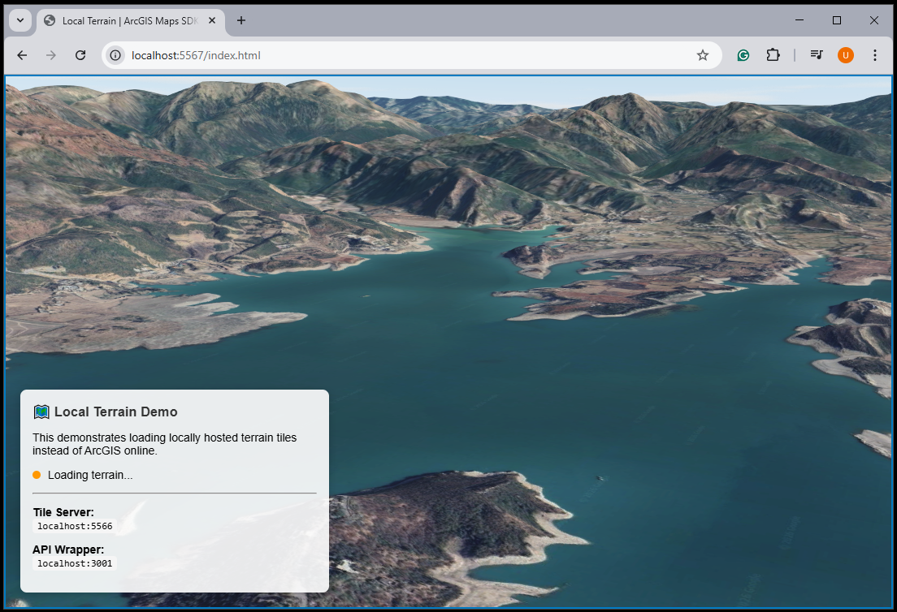
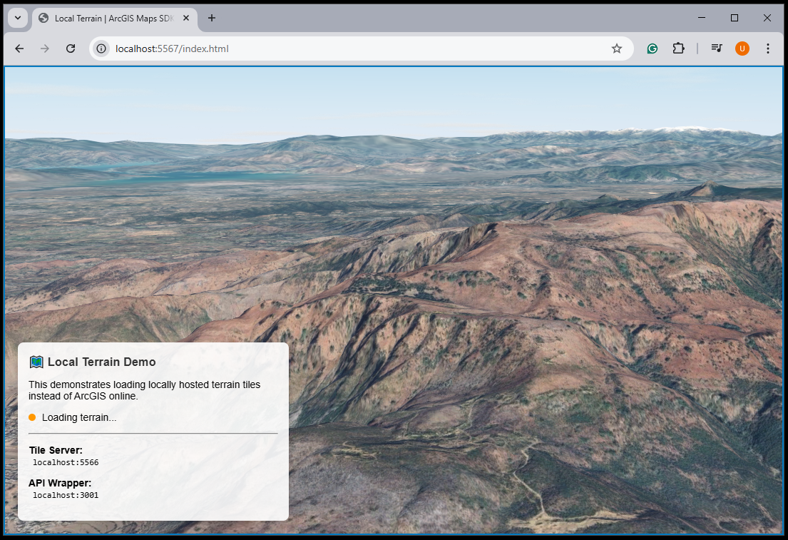

# 📦 ArcGIS Terrain ImageServer (Node.js)

A lightweight Node.js server that mimics an **ArcGIS Enterprise ImageServer** to host terrain elevation tiles locally for the **ArcGIS JavaScript SDK**.

This allows you to use offline terrain elevation data without deploying a full ArcGIS Enterprise stack.

------

## 🚀 Purpose

The ArcGIS API for JavaScript expects terrain services in the ArcGIS REST ImageServer format.
 Normally, this requires ArcGIS Enterprise.

This project:

- Hosts elevation data from `.mbtiles`
- Exposes ArcGIS-compatible REST endpoints
- Proxies tile requests
- Automatically generates:
  - Service metadata
  - LOD pyramid
  - Spatial extent
- Enables **fully offline 3D terrain in ArcGIS JS**

------

## 🗺 Elevation Source

Tiles can be downloaded from:

- **ESRI World Elevation 3D**

  ```
  https://elevation3d.arcgis.com/arcgis/rest/services/WorldElevation3D/Terrain3D/ImageServer/tile/{z}/{y}/{x}
  ```

To download tiles:

👉 Use:
 https://github.com/AliFlux/MapTilesDownloader

### MapTilesDownloader Setup

1. Open:

   ```
   MapTilesDownloader/src/UI/main.js
   ```

2. Add your Mapbox API key:

   ```
   mapboxgl.accessToken = "YOUR_MAPBOX_KEY"
   ```

   (Free key from Mapbox)

3. Add the ESRI elevation URL to:

   ```
   var sources = { ... }
   ```

4. Generate your `.mbtiles` file.

------

# 🏗 Architecture

This project runs **two servers**:

### 1️⃣ ArcGIS ImageServer Wrapper

(Default: `http://localhost:3001`)

Implements:

```
/arcgis/rest/services/LocalTerrain3D/ImageServer
/arcgis/rest/services/LocalTerrain3D/ImageServer/tile/{level}/{row}/{col}
```

It:

- Returns ArcGIS-compatible service metadata
- Dynamically builds LOD pyramid
- Proxies tile requests to MBTiles backend
- Responds with LERC elevation tiles
- Handles CORS

------

### 2️⃣ MBTiles Tile Server

(Default: `http://localhost:5567`)

Serves:

```
/tiles/{fileName}/{level}/{col}/{row}
```

Reads directly from:

```
./tiles/{YourFile}.mbtiles
```

------

# 📂 Project Structure

```
project-root/
│
├── index.js
├── index.html          (sample viewer)
├── tiles/
│   └── PakistanDTEDtiles.mbtiles
└── package.json
```

------

# ⚙️ Installation

```
git clone <your-repo>
cd <your-repo>
npm install
```

------

# ▶️ Running the Server

```
node index.js
```

or

```
npm start
```

------

# 🌐 Available Endpoints

### 🔹 Service Directory

```
http://localhost:3001/arcgis/rest/services
```

### 🔹 ImageServer Metadata

```
http://localhost:3001/arcgis/rest/services/LocalTerrain3D/ImageServer
```

### 🔹 Tile Endpoint

```
http://localhost:3001/arcgis/rest/services/LocalTerrain3D/ImageServer/tile/{level}/{row}/{col}
```

### 🔹 Health Check

```
http://localhost:3001/health
```

------

# 🧠 Key Features

- ✅ ArcGIS ImageServer REST compatibility
- ✅ Offline terrain support
- ✅ Auto-detect MBTiles extent
- ✅ Auto-generate LOD levels
- ✅ Web Mercator (WKID 3857)
- ✅ LERC tile support
- ✅ CORS enabled
- ✅ Lightweight (no ArcGIS Enterprise required)

------

# 🔧 Configuration

Inside `index.js`:

```
const DtedFilename = "PakistanDTEDtiles";
```

Change this to match your `.mbtiles` file name.

Also configurable:

```
CONFIG.port          // ImageServer wrapper port
CONFIG.mbtilesServer // Tile backend server
```

------

# 🗺 Spatial Reference

- Projection: Web Mercator
- WKID: 3857
- Pixel Type: F32
- Format: LERC
- Data Type: Elevation

------

# ⚠️ Limitations

- Query endpoint not supported
- Single-band elevation only
- Requires MBTiles in Web Mercator
- Designed for terrain only (not imagery)

------

# 💡 Use Case

Perfect for:

- Offline 3D terrain viewers
- Defense / simulation systems
- Flight simulation environments
- Secure internal GIS systems
- Game-like ArcGIS JS integrations

------

# 📸 Example Usage in ArcGIS JS

```
const elevationLayer = new ElevationLayer({
  url: "http://localhost:3001/arcgis/rest/services/LocalTerrain3D/ImageServer"
});
```

------

# 🛠 Future Improvements (Optional Ideas)

- Support multiple terrain datasets
- Add caching layer
- Support imagery services
- Add tile pre-validation
- Add Docker support

------

# 🖥 Demo HTML (Included)

This project includes a ready-to-use `index.html` demo that verifies your local terrain service is working correctly.

The demo uses the ArcGIS Maps SDK for JavaScript to render a 3D scene powered by your locally hosted terrain instead of ArcGIS Online’s default elevation service.

------

## 🎯 What the Demo Shows

- Loads terrain from your **local Node.js ImageServer wrapper**
- Displays a 3D `SceneView`
- Uses:
  - Local elevation (`ElevationLayer`)
  - Custom basemap (VectorTileLayer style)
  - Optional satellite imagery layer
- Shows a live terrain load status indicator
- Designed for fullscreen / MFD-style displays (no default UI)

------

## 🔗 Terrain Connection

The key part of the demo:

```
const localElevationLayer = new ElevationLayer({
  url: "http://localhost:3001/arcgis/rest/services/LocalTerrain3D/ImageServer"
});
```

Instead of:

```
ground: "world-elevation"
```

It uses:

```
const localGround = new Ground({
  layers: [localElevationLayer],
  navigationConstraint: { type: "stay-above" }
});
```

This forces ArcGIS JS to consume your **offline terrain service**.

------

## 🌍 Initial Camera Location

The demo initializes over Islamabad, Pakistan:

```
latitude: 33.77932500302994,
longitude: 72.94201260476956,
z: 3990
```

You can modify these values to focus on your downloaded terrain region.

------

## 🧩 Basemap Layers Used

The demo includes:

- A VectorTile basemap style from Esri
- Optional satellite layer via Google tile endpoint

If running fully offline, you can replace:

```
urlTemplate: "https://mt1.google.com/vt/..."
```

with your own local tile server.

------

## 🟢 Terrain Status Indicator

The demo includes a small UI panel that:

- 🟡 Shows "Loading terrain..."
- 🟢 Turns green when terrain loads successfully
- 🔴 Turns red if the service fails

This helps debug:

- MBTiles path issues
- Port mismatches
- Incorrect LOD levels
- CORS issues

------

## ▶ How to Run the Demo

1. Start the Node.js server:

   ```
   npm run start
   ```

2. Open in browser:

   ```
   http://localhost:5567
   ```

(Express serves `index.html` automatically.)

1. Ensure:
   - MBTiles file exists in `/tiles`
   - Wrapper server is running on port `3001`

------

## 🛠 Demo Architecture

```
Browser (ArcGIS JS SceneView)
        ↓
ElevationLayer
        ↓
http://localhost:3001/arcgis/rest/services/LocalTerrain3D/ImageServer
        ↓
Node.js ImageServer Wrapper
        ↓
MBTiles Server (port 5567)
        ↓
PakistanDTEDtiles.mbtiles
```

------

## 📦 Why This Demo Matters

ArcGIS JS will **only treat terrain correctly** if:

- The service matches ImageServer REST structure
- TileInfo matches expected LOD pyramid
- Spatial reference = WKID 3857
- Pixel type = F32
- Format = LERC

This demo confirms your implementation meets those requirements.

------

## 💡 Recommended Usage

The demo is ideal for:

- Testing offline terrain
- Military / secure environments
- Flight simulation
- Embedded systems
- Custom GIS engines

------

**Demo page in Action:**





# 📄 License

MIT (or specify your preferred license)